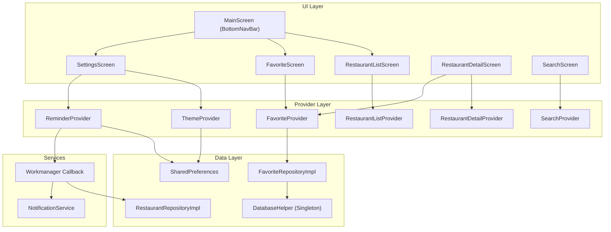

# Arsitektur Aplikasi

## Pola Arsitektur

Aplikasi ini menerapkan arsitektur **3 Layer** yang memisahkan tanggung jawab ke dalam lapisan berbeda:

```
┌─────────────────────────────────────────┐
│             UI Layer (Screens)          │
│   StatelessWidget / StatefulWidget      │
│   context.watch / context.read          │
├─────────────────────────────────────────┤
│           Provider Layer (State)        │
│   ChangeNotifier + Sealed Class State   │
├─────────────────────────────────────────┤
│            Data Layer (Repository)      │
│   Abstract Interface → Implementasi     │
│   HTTP Client / SQLite / SharedPrefs    │
└─────────────────────────────────────────┘
```

## Diagram Dependensi



## Penjelasan Tiap Layer

### 1. UI Layer (`lib/ui/`)

Layer ini berisi semua widget yang **ditampilkan ke pengguna**. Terdiri dari:

- **Screens** — halaman penuh yang ditampilkan di dalam `Scaffold`
- **Widgets** — komponen reusable seperti `RestaurantCard`, `ErrorView`, `LoadingIndicator`

Prinsip utama:
- Gunakan `StatelessWidget` sebanyak mungkin
- `StatefulWidget` hanya untuk widget yang butuh `TextEditingController` atau lifecycle lain
- Akses state melalui `context.watch<T>()` (reaktif) dan `context.read<T>()` (one-time)
- Bungkus `context.watch` dalam `Builder` agar **hanya widget di dalam Builder yang rebuild**

### 2. Provider Layer (`lib/providers/`)

Layer ini mengelola **business logic dan state**. Setiap provider:

- Extends `ChangeNotifier`
- Menyimpan state menggunakan **sealed class** (Dart 3)
- Memanggil `notifyListeners()` untuk memberitahu UI bahwa state berubah

Sealed class memungkinkan pattern matching yang exhaustive:

```dart
sealed class RestaurantListState {}
class RestaurantListInitial extends RestaurantListState {}
class RestaurantListLoading extends RestaurantListState {}
class RestaurantListLoaded extends RestaurantListState {
  final List<Restaurant> restaurants;
  RestaurantListLoaded(this.restaurants);
}
class RestaurantListError extends RestaurantListState {
  final String message;
  RestaurantListError(this.message);
}
```

Di UI, kita bisa gunakan `switch` yang type-safe:

```dart
return switch (provider.state) {
  RestaurantListInitial() => const SizedBox.shrink(),
  RestaurantListLoading() => const LoadingIndicator(),
  RestaurantListError(:final message) => ErrorView(message: message),
  RestaurantListLoaded(:final restaurants) => ListView.builder(...),
};
```

### 3. Data Layer (`lib/data/`)

Layer ini berisi:

- **Models** — Plain Dart class untuk merepresentasikan data (`Restaurant`, `RestaurantDetail`, dll.)
- **Repositories** — Abstract interface + implementasi untuk akses data
- **Local** — Database helper untuk SQLite

#### Repository Pattern

```dart
// Abstract interface (kontrak)
abstract interface class RestaurantRepository {
  Future<List<Restaurant>> getList();
  Future<RestaurantDetail> getDetail(String id);
}

// Implementasi (bisa diganti dengan mock saat testing)
class RestaurantRepositoryImpl implements RestaurantRepository {
  final http.Client _client;
  // ...
}
```

Keuntungan:
- Provider tidak bergantung langsung pada HTTP client
- Mudah di-mock saat testing
- Bisa diganti implementasi tanpa mengubah provider/UI

## Dependency Injection

Semua dependency di-inject melalui `MultiProvider` di `app.dart`:

```dart
MultiProvider(
  providers: [
    Provider<RestaurantRepository>(create: (_) => RestaurantRepositoryImpl()),
    Provider<FavoriteRepository>(create: (_) => FavoriteRepositoryImpl()),
    ChangeNotifierProvider(create: (_) => ThemeProvider(prefs)),
    ChangeNotifierProvider(
      create: (ctx) => RestaurantListProvider(ctx.read<RestaurantRepository>()),
    ),
    // ...
  ],
)
```

`SharedPreferences` diinisialisasi di `main()` sebelum `runApp()` dan diteruskan sebagai parameter ke `App` widget.

## Alur Data: Dari API ke UI

```
1. User membuka app
2. RestaurantListProvider dibuat → constructor memanggil fetchList()
3. fetchList() → set state Loading → notifyListeners()
4. UI rebuild → tampilkan LoadingIndicator
5. Repository.getList() → HTTP GET ke API
6. Data berhasil → set state Loaded(restaurants) → notifyListeners()
7. UI rebuild → tampilkan ListView dengan RestaurantCard
```

## File Structure

```
lib/
├── main.dart                   # Entry point, init services
├── app.dart                    # MultiProvider + MaterialApp
├── core/                       # Shared utilities
│   ├── constants/              # App constants, error messages
│   ├── exceptions/             # Custom exception class
│   ├── models/                 # AppColor, AppFont
│   └── theme/                  # Light/dark ThemeData factory
├── data/                       # Data layer
│   ├── local/                  # DatabaseHelper (SQLite singleton)
│   ├── models/                 # Data models (Restaurant, dll.)
│   └── repositories/           # Abstract interfaces + implementations
├── providers/                  # State management
│   ├── states/                 # Sealed class state definitions
│   └── *.dart                  # ChangeNotifier providers
├── services/                   # Background services
│   ├── notification_service.dart
│   └── workmanager_service.dart
└── ui/                         # Presentation layer
    ├── screens/                # Full-page screens
    └── widgets/                # Reusable widget components
```
